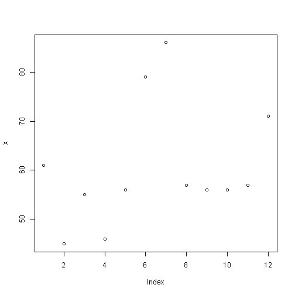
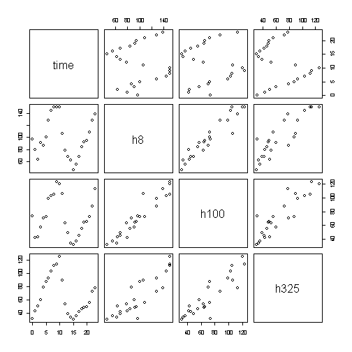
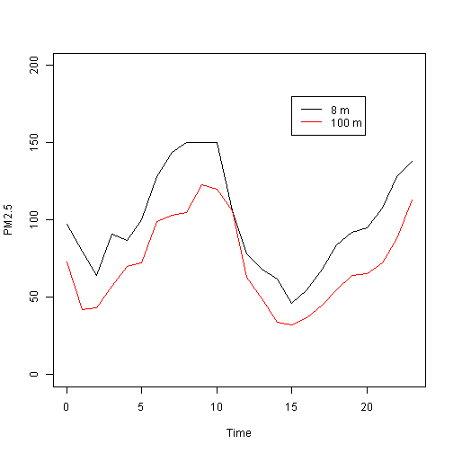
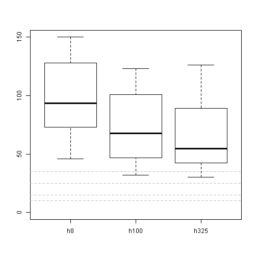
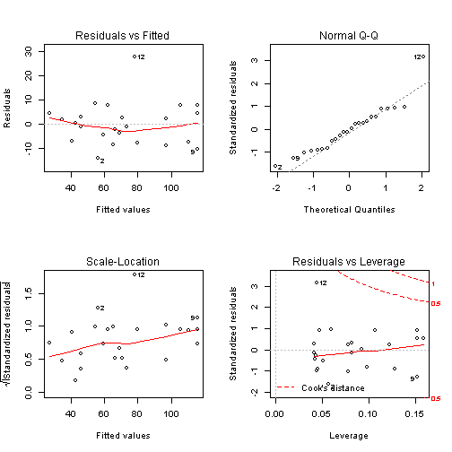
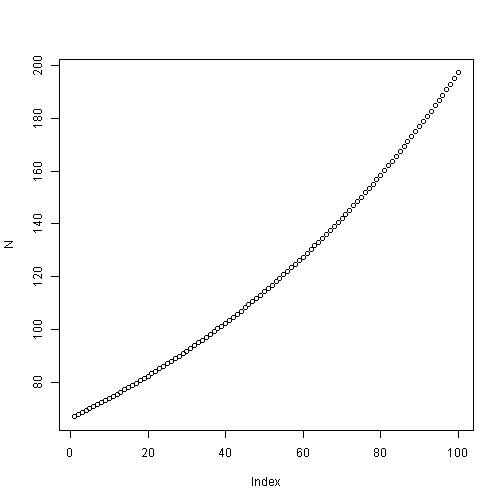
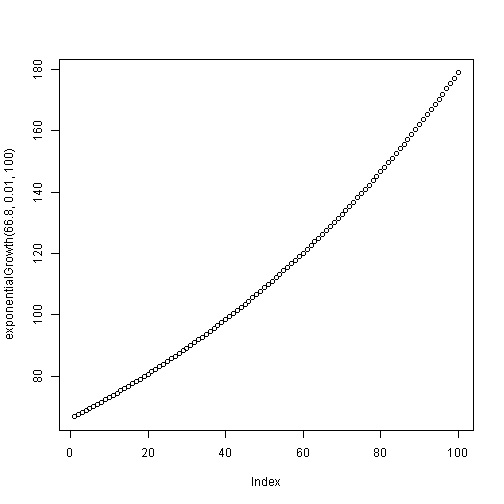

# **R** 菜鸟入门 
作者：[dapeng](http://dapengde.com)
原载：[晴耕雨讀志](http://dapengde.com/r4dummies)

## 第00篇 缘起

如果你和当初的 dapeng 一样是个菜鸟，对 **R** 有浓厚的兴趣，只是苦于入不了门，在门口纠结徘徊不忍离去，那么，这个系列的帖子就是写给你的。

以前 dapeng 曾为两个难题烦恼不已，一个是谈恋爱，一个是学习 **R** 。两件事情的共同特点是：在它们面前 dapeng 一直是个菜鸟，任凭花费多少时间去读入门教材，什么 *The R Book* ， *An Introduction to R* ，*R for Beginners* 等等，这扇门就是推不开。越推不开越想推。这种困境一直持续到 dapeng 修了大学里开设的 *Introduction to R* 课程之后。这门课程是拜罗伊特大学生态地理模拟研究组的 Björn Reineking 教授为全校公开开设的，链接点[这里](http://www.biomod.uni-bayreuth.de/biomod/en/lehre/lehre/lehre_detail.php?id_obj=88980)。一个学期下来，受益匪浅。课程结束后， dapeng 特意征求 Reineking 教授的同意把讲义分享给在中国的朋友，他欣然应允。于是 dapeng 打算公开之前整理一下，哪知道一整理，一晃两年过去了。

这两年间， **R** 助 dapeng 完成了博士研究期间全部的数据处理，论文中几乎所有的作图都是 **R** 实现的。可以说，如果没有学习 **R** 和使用 **R** 带来的乐趣，那么 dapeng 的博士研究生活必定会枯燥很多。然而，回顾学习 **R** 的历程，奇怪的是， dapeng 始终没有找到像 Reineking 教授课程那样菜鸟入门级的 **R** 教材。事实上，关于 **R** 的教材不是太少，而是太多，而即便是入门级的，那些标有 *Introduction* 或 *Beginners* 字样的，对于 dapeng 这种非统计学非计算机专业的，只在大学公选课修过 *普通统计学* 的人来说，还是门槛太高。如今快要毕业， dapeng 觉得，是时候把 Reineking 教授课程笔记梳理一下了，希望那些和 dapeng 一样的菜鸟们，碰巧读到这些文字后，学习 **R** 的情形有所不同。

那么，让我们开始第一个问题：**R 是什么？**

答案一搜一大堆。菜鸟 dapeng 的解释是，如果你用 Excel 计算过一列数的平均值，或者用 OriginLab 或 SigmaPlot 玩过科技制图，或者用 Matlab 编程建模，那么，**R** 跟它们一样，是用来进行数据处理、作图、编程的软件。

既然一样，别的软件用得好好的，**干嘛要换用 R**？

跟很多理科生一样，dapeng曾用过 Excel（本科论文）和 OriginLab （硕士论文），但博士期间换用了 **R**。见到好的，只要不违法不缺德，自然要换。

    思考：你家附近的一家餐厅又贵又脏又难吃，但你不知道有别的餐厅，没选择的情况下习惯了这家。当你得知附近还有一家整洁便宜服务好的，你愿不愿意换？
    

那么， **R 好在哪里？**

这个就见仁见智了。 dapeng 是那种贪图便宜的人，看上 **R** 是看上了它的 **免费** 和 **随心所欲** 。你说盗版的 Excel，OriginLab，Matlab 也免费？咳咳，dapeng 也是混过来的，只是如今年岁越大，胆子越小，违法的事儿还是少干吧，尤其是当了爹之后， dapeng 觉得，不想让孩子做的事儿，当爹的最好就别做。当然，不光免费和灵活，还有 **R** 功能的**强大**，**R** 社区的 **友好** 等等，网上搜搜看吧。从 dapeng 的角度说，没有 **R**， dapeng 的博士研究可能完全是另外一个模样。 比如 dapeng 得意洋洋地炫耀一下下面这张 dapeng 博士论文中的插图，当然在老鸟眼里也就是入门级的，但是菜鸟 dapeng 却为此兴奋不已，因为用别人定义好的函数，一个语句不到一分钟就搞定了，太适合 dapeng 这种懒人。

<br>*图00.1. dapeng 的博士论文插图。对角线上是 7 个变量的直方图和平滑曲线，对角线以左是这 7 个变量两两之间的散点图和 loess 拟合曲线，对角线以右是两两之间的相关系数（正负用数字的颜色区别，相关程度用字体的大小表示）。*

    思考：上图用 Excel 或 OriginLab 或 SigmaPlot 该怎么做？
    

不光是论文作图，**R** 还能很容易做出 3D 动画来演示。下面是 dapeng 博士预答辩演示的一个图：

<br>*图00.2. **R** 做出的 3D 动画。*

不光是枯燥的科技作图和演示，**R** 还可以娱乐。比如可以画一颗立体中国心：

<br>*图00.3. R做出的中国心。*

当然可以很容易地把国旗换成别的，比如 mm 的照片，或者——

<br>*图00.4. 晴耕雨讀志在我心。*

如果你开始对 **R** 有兴趣的话， **R菜鸟入门** 将循着 Reineking 教授讲义的思路，加上 dapeng 的学习心得，从零开始，大概用十几篇短文的篇幅带你跨上那个门槛，把那扇门推开一条缝 —— dapeng 希望自己能坚持写完。最后的目标——成为 **R** 高手——别做梦了。不过，至少，能作出上面几个图来。

我们开始吧。

## 第01篇 超级计算器
*开胃小菜:*  
*男人至少要擅长一项运动，一种乐器，一种编程….和拿手的几个小炒。（语出[小鸟学AHK](http://hi.baidu.com/cttfssdtvxbgsyr/item/33a1304c9baa55e6bdf451a6)）*

**R** 菜鸟入门三大秘诀：
* 第一秘诀： **不要害怕** ！学 **R** 非难事，Anyone can R (谁都可以贰).
* 第二秘诀： **能用就行** ！只要能完成工作就行，**R** 代码写得漂亮与否并不重要。一个问题如果你有两个解决办法，那就选用你曾用过的那个。时间有富余的话再试另一个。
* 第三秘诀： **与人分享** ！跟同学或同事分享 **R** 代码。这就是为啥 dapeng 写这个系列的帖子。

初见 **R**，可以用在线版品尝一下，点[这里](http://www.math.montana.edu/Rweb/)或[这里](http://pbil.univ-lyon1.fr/Rweb/)，用法在这里不做介绍了，因为 dapeng 还是建议菜鸟从下载安装开始。点击[这里](http://cran.rstudio.com/)下载 **R** 程序。**R** 是跨平台的，一般来说，Linux 用户自己善于折腾，不必 dapeng 在这里唧唧歪歪了，因此晴耕雨讀志以 Windows 系统为例作介绍。目前 **R** 的最新版 2.15.3 安装程序只有 47 M，比起几个G的 Matlab 要苗条多了。下载完毕后安装，一路`下一步`的傻瓜式安装即可。安装完毕之后就可以用了。

不过，初见的 **R** 在裸奔，界面丑陋， dapeng 建议给 **R** 穿上一件衣服，奔时看上去体面一些。能穿的免费衣服很多，人们各有所爱。dapeng 用过 Tinn-R、 RKward、 Vim+插件之后，最后选定了 **Rstudio** (点[这里](http://www.rstudio.com/ide/download/desktop)下载，免费正版哦)。选用 Rstudio 有诸多好处，最明显的就是把 **R** 常用的界面整合到了一起。 看吧，华丽丽的就像 Matlab ，默认四个子窗口：左上窗输入代码，左下窗看结果，右上窗显示变量值，右下窗显示作图和帮助：

<br>*图01.1. Rstudio 工作窗口。图片来自 Rstudio 官网，中文解释是 dapeng 加的。*

Rstudio 还有很多好处，比如本文就是用 Rstudio 的 markdown 下写成的。下文均以 Rstudio 来示范 **R** 的使用。下载安装 Rstudio ，运行，然后选择菜单 *File - New - R script* ，或按快捷键 ctrl+shift+n，会新建一个 **R** 文件。好的，现在正式开始  **R**  之旅。

 **R**  最简单的功能，是用作计算器。先在左上窗口输入以下代码，然后按窗口上方的运行（Run）按钮，或按快捷键 ctrl+回车，就会运行光标所在行的整行代码：


```r
3 * (2 + 2)
```

```
## [1] 12
```


上面第一行是输入的代码示例，第二行用两个 `#` 号开头的是 Rstudio 左下窗显示的运行结果。如不另作说明，下文都用这种格式来区分代码和运行结果（谢谢谢易辉的 knitr！）。先不用管 # 号后面的 [1] 是什么。 **R** 的数学基本运算符有 加 `+`， 减 `-`，乘 `*`，除 `/`，乘方 `^`，整除的商 `%/%`，整除的余数 `%%`。

    练习 01.1：计算365除以7得到的整除商和余数。

下面，我们开个平方。输入并运行


```r
sqrt(9)  # 开平方
```

```
## [1] 3
```

这里，`sqrt` 是开平方的函数，被开方的数必须放在圆括号里，这是 **R** 语法的基本规则之一。`#` 号后面一直到这一行的末尾是注释，注释部分不会被运行，这样是为了方便理解这句代码的用途。为了节省篇幅，下文尽量在代码中用注释的方式来说明。

有人读到这里可能会被吓住了：`sqrt`，开玩笑，我怎么记得住啊！注意 **R** 入门第一秘诀： **不要被 R 吓住！** 试试只输入 `s`，然后按 tab 键，就会出现贴心的提示，所有以 `s` 打头的函数都列在里边了，用鼠标或箭头键选取就行了。在 `s` 后面再接着输入 `q` 试试。

其实，常用的函数就那么几个，用几次就不需要贴心提示了。而且函数名称都很好记，`sqrt` 就是 **sq**ure **r**oo**t** 的缩写，你不是恰好想练英文吗。实在记不住，那就用基本运算符来求乘方好了， `9 ^ 0.5` 即可。将来你甚至可以把 `sqrt` 改名叫做 `kaipingfang`。条条道路通罗马， **R** 很灵活的。

常用函数都可以顾名思义：四舍五入 `round()`， 截取整数 `trunc()`， 开平方 `sqrt()`，求绝对值 `abs()`，指数函数 `exp()`，自然对数函数 `log()`，以 10 为底的对数函数 `log10()`，三角函数 `sin() cos() tan() asin() acos() atan()`。

    练习 01.2：大牛 Knuth 有个趣闻：他创建的 TEX 版本号趋近于圆周率 pi，他创建的 Metafont 版本号趋近于自然对数的底 e。pi 和 e 的值是多少？

 **R**  中 `pi` 的值已经定义好了，只要输入并运行


```r
pi
```

```
## [1] 3.142
```

怎么只有这几位？精确度不够高啊。要提高精确度，需要

```r
options(digits = 22)  # 最大支持 22 位
pi
```

```
## [1] 3.141592653589793115998
```

```r
exp(1)  # 计算 e
```

```
## [1] 2.718281828459045090796
```

```r
e <- exp(1)  # 把 exp(1) 的值保存到一个变量 e 里，方便以后调用：
```


其中，`<-` 是个箭头，表示把右边的值赋给左边，Rtudio 中输入箭头的快捷键是 alt + _ 。也可以用等号 `=`。箭头的灵活之处在于，还可以把左边的值赋给右边：

```
exp(1) -> e
```

好了，以后可以用e来代表自然对数的底了。查看 e 的值，可以看 Rstudio 的右上窗，也可以在代码窗口输入变量名 `e`，然后 ctrl + 回车，


```r
e
```

```
## [1] 2.718281828459045090796
```


就会在结果窗口出现 e 的值。e 可以用来做后续计算，比如：


```r
round(e)^2
```

```
## [1] 9
```


注意， **R** 中大小写字母是有区别的，`E` 和 `e` 是不同的两个变量名。这叫做“大小写敏感”。

变量名的约定：

变量可以
* 是一个或多个字母，如 `e, x, mydata`；
* 也可以包括数字，如 `a1, a2`; 
* 可以包括句点和下划线，如 `temperature_air, humidity.max`。  

但是，
* 不可以包含空格，如不能是 `my data`；
* 不可以用数字或小数开头，如不能是 `2x`，也不能是`.3y`；
* 不可以是R的内置变量。这个不必担心，遇见的时候 **R** 自动发警告。

菜鸟只要注意 **变量名不要加空格** ，就不会犯大错。

一个变量名可以存储很多数据。比如说，拜罗伊特月降水量从一月到十二月依次是：61, 45, 55, 46, 56, 79, 86, 57, 56, 56, 57, 71 mm。可以把这十二个数据赋值给一个变量 x，称为向量：


```r
options(digits = 3)  # 精确位数太多了，还是调回初始值 3 吧。
x <- c(61, 45, 55, 46, 56, 79, 86, 57, 56, 56, 57, 71)  # 拜罗伊特月降水量
x
```

```
##  [1] 61 45 55 46 56 79 86 57 56 56 57 71
```

```r
x[4]  # 四月的降水量。方括号中的 4 表示调用 x 中的第四个数值。
```

```
## [1] 46
```


    练习 01.3：2003 年 8 月北京城区测得的 PM2.5 的质量浓度日变化（数据来源：Chan et al., 2005. Atmospheric Environment 39, no. 28 : 5113-5124）, 从 0 时到 23 时 依次是97, 80, 64, 91, 87, 100, 128, 144, 150, 150, 150, 106, 78, 68, 62, 46, 55, 68, 84, 92, 95, 108, 128, 138 微克每立方米（十年前就超标了啊！）。计算 PM2.5 早高峰（6时到10时）时段占全天的比例。

**R** 支持向量运算。试试输入：


```r
x + 100
```

```
##  [1] 161 145 155 146 156 179 186 157 156 156 157 171
```


x 里的每一个数都加上了 100 。这就是向量运算的好处：简单的代码，避免逐个计算。

下面，让我们作出第一个图形来：拜罗伊特降水量的季节变化。敲7个键就行了：


```r
plot(x)  # 作图
```

 

是不是很简单？是不是很激动？懒人都喜欢简单的。

再进一步，我们来做统计运算，看看拜罗伊特每月降水量的平均值是多少。


```r
(x[1] + x[2] + x[3] + x[4] + x[5] + x[6] + x[7] + x[8] + x[9] + x[10] + x[11] + 
    x[12])/12  # 计算平均值
```

```
## [1] 60.4
```

```r
sum(x)/length(x)  # 计算平均值的简化方法。sum() 是求和函数，length() 给出向量长度。
```

```
## [1] 60.4
```

```r
mean(x)  # 进一步简化。平均值函数。
```

```
## [1] 60.4
```


常用统计函数：求和 `sum()`，平均值 `mean()`，最大值 `max()`，最小值 `min()`，范围 `range()`，中位数 `median()`，标准差 `sd()`，方差 `var()`。 

    练习 01.4：使用练习 01.3 中所用的数据，做出北京 PM2.5 的日变化图。计算 PM2.5 出现的最大值、最小值、平均值。最大值出现在几点钟？
    
最后，请在Rstudio菜单栏点击 *File-Save*，或按快捷键 ctrl+s，把刚才输入的代码保存到一个文件里，下一节接着用。

好啦，以上就是 **R** 的基本操作和运算、作图、统计分析，你已经掌握了！ **R** 就差不多学完啦！喝一杯庆祝一下吧。
    
## 有用的信息：
-  | -
------------- | -------------
安装和运行     | `cran, rstudio`
数学基本运算符 | `+ - * / ^ %/% %%`
常用函数       | `round() trunc() sqrt() abs() exp() log() log10() sin() asin()`
赋值           | `<- = ->`
作图           | `plot()`
常用统计函数   | `sum() mean() max() min() range() median() sd()var()`
其他  |  R 菜鸟们，请早高峰时注意健康


## 第02篇 数据

在第 01 篇里，我们学会了用 **R** 进行一般的数学运算和统计计算，并且做出了两张图：拜罗伊特降水的季节变化图，北京的 PM2.5 日变化图。很好，只是，这些数据总不能一个一个敲到代码里吧。要是处理保存在其他文件里的大量数据呢？本篇就解决这个问题。

*开胃小菜： 在 Rstudio 左下窗口输入代码 demo(graphics)，然后按回车，再回车，再回车，再回车……*

点击[这里](http://dapengde.com/wp-content/uploads/2013/03/dapengde_DummyR_PM25.csv)下载一个数据文件，保存到一个文件夹里，比如 *c:\R\data* 文件夹（为避免不必要的麻烦，文件夹名称中都不要带空格和中文字符），我们看看如何对其中的数据进行操作。

首先，我们要告诉 **R** 数据在哪里。不习惯命令行的用户，可以这样获取这个文件的路径：

```
mydata1 <- file.choose() # 在弹出的窗口中选择文件，其路径存储到mydata里。
mydata1
```

这个文件的文件名叫做 *dapengde_DummyR_PM25.csv* 。鼠标选择文件比较麻烦，为了下次再使用这个代码的时候不必再点一次，一般都是直接输入文件路径：


```r
mydata2 <- "c:\\R\\data\\dapengde_DummyR_PM25.csv"  # 路径要用引号(单双都行)，表示这是一个字符串。
mydata2
```

```
## [1] "c:\\R\\data\\dapengde_DummyR_PM25.csv"
```

注意，文件路径中的斜线`\`本来是一个，但是在 **R** 代码中必须改成两个（ **切记切记！** ），或改成一个反斜线`/`，其中自有道理，暂时不必深究。

我们先在文件浏览器中双击打开这个文件看看，这是个 csv 文件，用记事本或 Excel 就可以打开，或者在 Rstudio 代码窗口输入

```
file.show(mydata2) # 查看文件
```
就会用默认程序打开。

这是2003 年 8 月在北京城区的三个高度（8 米，100 米，325 米）测得的 PM2.5 的质量浓度日变化（数据来源：Chan et al., 2005. Atmospheric Environment 39, no. 28 : 5113-5124），共 4 列 25 行。

现在让 **R** 读取文件。如果你喜欢拷贝粘贴的方式，那么可以在 Excel 选中数据区，拷贝，然后在 **R** 中这样读取其中的数据：

```
pm1 <- read.table(file = "clipboard", header = TRUE) # 读取剪切板里的数据，保存到 pm1 这个数据框变量里。header 表示数据的第一行为列名称。
```
Rstudio 右上窗就出现了 `pm1` 的信息，可以单击看内容，也可以用输入代码查看：

```
pm1
```

'read.table' 用来读取数据表格。看起来也太复杂了吧？怎么记得住？对，一般人都记不住，忘了就随手查查帮助，输入并运行：

```r
?read.table
```

Rstudio此时会在右下窗显示帮助信息，有详细的解释和实例。好好读读吧，以后你会发现， **问号+函数名** 是会经常用的命令。


**R** 菜鸟入门三大法宝：
* 第一法宝： **问号** ！问号+函数名，简直就是身边的诸葛亮，随时方便地查看帮助文档。
* 第二法宝： **google** 和 **wiki** ！大事不决问维基 ，小事不决问谷歌。
* 第三法宝： **论坛** ！内事不决问张昭（中文论坛，如[这里](http://cos.name/cn/)），外事不决问周瑜（英文论坛，如[这里](http://r.789695.n4.nabble.com/)）。

用拷贝粘贴的方式读取数据，优点是灵活，适合临时用一下。更多情况下，是直接按指定的路径去读文件：

```r
pm2 <- read.table(file = mydata2, header = TRUE, sep = ",")  # 读取逗号分隔的数据。sep 表示数据列的分隔符。
pm <- read.csv(file = mydata2)  # 与上一个命令等同，专门用来读逗号分隔的文件。
```

你要问 'read.csv'是怎么回事？请试试你的第一法宝。

数据画个图看起来更直观：

```r
plot(pm)
```

 

任意两列的散点图就这么容易地做出来了。如果你有十列八列的，就会发现这是多么省事啊！懒人的福音啊！dapeng 一般在读入数据文件后的第一件事就是`plot`一下，对数据有个整体的感觉。第二件事一般是看看这个文件的总结报告

```r
summary(pm)
```

```
##       time             h8             h100            h325      
##  Min.   : 0.00   Min.   : 46.0   Min.   : 32.0   Min.   : 30.0  
##  1st Qu.: 5.75   1st Qu.: 75.5   1st Qu.: 48.0   1st Qu.: 42.8  
##  Median :11.50   Median : 93.5   Median : 67.5   Median : 54.5  
##  Mean   :11.50   Mean   : 98.7   Mean   : 72.1   Mean   : 65.5  
##  3rd Qu.:17.25   3rd Qu.:128.0   3rd Qu.:100.0   3rd Qu.: 88.5  
##  Max.   :23.00   Max.   :150.0   Max.   :123.0   Max.   :126.0
```

这下可省事儿了，上一节我们用的最大值、最小值、中位数、平均值函数，用`summary`这一条命令就全部搞定，顺便还附送了四分位数（`1st Qu.， 3rd Qu.`）。啥是四分位数？试试你的第二法宝。

怎么选取 `pm` 中的指定数值呢，比如说，9 点钟 8 米高处的PM2.5浓度？还记得上一节我们是如何选取 4 月的降水量吗？对，`x[4]`。类似地：

```r
pm[9, 2]  # 第 9 行, 第 2 列。
```

```
## [1] 150
```


要选取多个行呢？若记得用`c()`生成一个向量，那就好办了，比如选取偶数行，即 0、2、4、...、22 点钟8 米处的 PM2.5 浓度：

```r
pm[c(0, 2, 4, 6, 8, 10, 12, 14, 16, 18, 20, 22), 2]
```

```
##  [1]  80  91 100 144 150 106  68  46  68  92 108
```


这个 0 到 22 敲起来太麻烦了吧，懒人的办法是用`seq()`函数生成个数列：


```r
pm[seq(0, 22, 2), 2]
```

```
##  [1]  80  91 100 144 150 106  68  46  68  92 108
```

`seq(0, 22, 2)` 表示以 0 为起点，22 为终点，间隔（即步长）为 2 生成一个数列。比如步长是 1 的话，就用`seq(2, 22, 1)`。当然，更懒的做法是：


```r
pm[2:22, 2]
```

```
##  [1]  80  64  91  87 100 128 144 150 150 150 106  78  68  62  46  55  68
## [18]  84  92  95 108
```

这和上一条指令等效。

选取整行或整列：

```r
pm[, 2]  # 第 2 列全部。
```

```
##  [1]  97  80  64  91  87 100 128 144 150 150 150 106  78  68  62  46  55
## [18]  68  84  92  95 108 128 138
```

```r
pm[3, ]  # 第 3 行全部。
```

```
##   time h8 h100 h325
## 3    2 64   43   50
```


如果列数太多，总不能老去数第几列吧？别急，也可以这样选取：

```r
pm[, "h8"]
```

```
##  [1]  97  80  64  91  87 100 128 144 150 150 150 106  78  68  62  46  55
## [18]  68  84  92  95 108 128 138
```


或者用美元符号

```r
pm$h8
```

```
##  [1]  97  80  64  91  87 100 128 144 150 150 150 106  78  68  62  46  55
## [18]  68  84  92  95 108 128 138
```


`h8` 是要选取的列的名称。列名称都有哪些呢？用`names()`函数：

```r
names(pm)
```

```
## [1] "time" "h8"   "h100" "h325"
```


    练习02.1：请做出 100 米高处的 PM2.5 浓度日变化的散点图。
    练习02.2：请计算 100 米高处 PM2.5 浓度的平均值，最大值，最小值，中值。

从此以后，只要把你的数据文件保存成.csv文件，**R** 就可以容易地读取，进行后续处理了！

## 有用的信息：
-  | -
------------- | -------------
数据文件存储路径 | 不要空格，不要中文，读取时用双斜线。
读取文件      | `read.table(), read.csv()`
选取单元格       | `pm[3, 2]，pm[ , 2]，pm[3, ]，pm[,"h8"]，pm$h8`


## 第03篇 画图
在上两篇中，我们都用到了 `plot` 命令来作图。如果说 Excel 作图的方法是先按照默认的格式画好之后再让你涂涂改改，那么 **R** 作图的流程更亲切：铺开一张白纸，打好格，画数据点，画坐标轴，加图例。就像用纸笔画图。不像 Excel 那样自作聪明。每一步都清清楚楚掌控在你手里。

*开胃小菜： 在 Rstudio 左下窗口输入代码 demo(persp)，然后按回车，再回车，再回车，再回车……*

这里，我们接着上一篇读取的数据 pm，来画一些更漂亮的图片。


```r
pm <- read.csv(file = "c:\\R\\data\\dapengde_DummyR_PM25.csv")
plot(x = pm$time, y = pm$h8, xlab = "Time", ylab = "PM2.5", type = "l", ylim = c(0, 
    200))  # 以小时为 x 轴，8 米处的 PM2.5 浓度为 y 轴作图。设定两个坐标的名称。数据点类型为 l 即线型。设定 y 轴范围。
lines(x = pm$time, y = pm$h100, col = "red")  # 添加 100 米处 PM2.5 浓度曲线。
legend(x = 15, y = 180, legend = c("8 m", "100 m"), col = c("black", "red"), 
    lty = 1)  # 添加图例。
```

 

    练习03.1：请用问号查询 plot、lines、legend 的帮助文件。
    
添加图例的位置有多种设置方法。上面的例子是用坐标位置确定的。还可以用内置模板来指定：
```
legend("topleft", legend = c("8 m", "100 m"), col = c("red", "black"), lty = 1) # 图例添加在左上角。
legend(locator(1), legend = c("8 m", "100 m"), col = c("red", "black"), lty = 1) # 用鼠标确定图例的位置。
```
做出的图片出现在 Rtudio 右下窗，可以点击 *Export*，选择保存的格式和路径就可以了。不过，更经常用的是命令行方式：
```
pdf(file = "c:\\R\\data\output.pdf") # 打开一张pdf的白纸。
plot(x = pm$time, y = pm$h8, xlab = "Time", ylab = "PM2.5 at 8 m", type = "l", ylim = c(0, 200)) # 在白纸上画图
dev.off() # 画完了，把纸张收起来
```

下面，我们让图片复杂一点：
```
pdf(file = "c:\\R\\data\output2.pdf", width = 8, height = 5) # 设定纸张大小。
plot(x = pm$time, y = pm$h8, xlab = "Time", ylab = "PM2.5 at 8 m", type = "l", ylim = c(0, 200), axes=FALSE) # 画图，但坐标轴先空着。
axis(2) # 在左边画出 y 轴。
axis(4) # 在右边画出 y 轴。
axis(1, at = 0 : 23, labels = 0 : 23) # 在下面画出x轴，并在指定位置（at）标出刻度（labels）。
points(x = pm$time, y = pm$h100, col = "red", type = "l") # 增加一条线。
points(x = pm$time, y = pm$h325, col = "blue", type = "l") # 再增加一条线。
abline(h = c(10, 15 , 25, 35), col = "grey", lty = 2) # 增加几条水平线(世界卫生组织推荐的健康标准值)。
legend("top", legend = c("8 m", "100 m", "325 m"), col = c("red", "black", "blue"), lty = 1) # 添加图例。
box() # 画出边框。
dev.off()
```

散点图以外的图，用其他的命令，例如：

```r
boxplot(pm[, c("h8", "h100", "h325")], ylim = c(0, 150))
abline(h = c(10, 15, 25, 35), col = "grey", lty = 2)
```

 


    练习03.1：请给上面boxplot做的图添加图例，并保存为pdf。

**R** 的作图功能超级强大，看看[这里](http://gallery.r-enthusiasts.com)有很多例子，包含了源代码。
## 有用的信息：
-  | -
------------- | -------------
作图 | `plot(), boxplot()`
图上添加数据点和线      | `points(), lines(), abline(), box(), axis()`
添加图例       | `legend()`
保存图片 | `pdf()`


## 第04篇 模型
这一篇，我们试着进行线性拟合，示例所用的数据仍然是前两篇中的北京 PM2.5 质量浓度。

*开胃小菜： 在 Rstudio 左下窗口输入代码 example(nls)，然后按回车，再回车。*

经过了前几篇的练习，相信你已经熟悉了 # 号注释的方式。从今往后，我们尽量以这种方式来缩短文字篇幅。

```r
pm <- read.csv(file = "c:\\R\\data\\dapengde_DummyR_PM25.csv")
m <- lm(pm$h100 ~ pm$h8)  # 线性拟合
m  # 查看模型，显示斜率和截距。
```

```
## 
## Call:
## lm(formula = pm$h100 ~ pm$h8)
## 
## Coefficients:
## (Intercept)        pm$h8  
##     -11.471        0.846
```

```r
summary(m)  # 模型的详细总结报告。
```

```
## 
## Call:
## lm(formula = pm$h100 ~ pm$h8)
## 
## Residuals:
##     Min      1Q  Median      3Q     Max 
## -14.247  -7.113  -0.397   4.508  27.744 
## 
## Coefficients:
##             Estimate Std. Error t value Pr(>|t|)    
## (Intercept)  -11.471      6.013   -1.91     0.07 .  
## pm$h8          0.847      0.058   14.58  8.6e-13 ***
## ---
## Signif. codes:  0 '***' 0.001 '**' 0.01 '*' 0.05 '.' 0.1 ' ' 1 
## 
## Residual standard error: 8.94 on 22 degrees of freedom
## Multiple R-squared: 0.906,	Adjusted R-squared: 0.902 
## F-statistic:  213 on 1 and 22 DF,  p-value: 8.64e-13
```

```r
# 下面对拟合结果作图。
par(mfrow = c(2, 2))  # 把一张作图纸上分成两行两列。par() 在作图时很有用，请查看帮助。
plot(m)
```

 

```r
# 作图完毕。 给散点图添加拟合直线。
par(mfrow = c(1, 1))
plot(pm$h8, pm$h100, cex = 2, pch = 21, bg = "red", col = "green")
abline(m, col = "purple", lwd = 3)  # 添加趋势线
legend("bottomright", pch = c(21, NA), lty = c(NA, 1), legend = c("Data", "Linear fit"), 
    pt.bg = "red", col = c("green", "purple"), lwd = c(NA, 2))
```

 

## 有用的信息：
-  | -
------------- | -------------
线性拟合 | `lm()`
非线性拟合 | `nls()`
作图设置 | `par()`


## 第05篇 循环

前两天 dapeng 用 **R** 给师妹做了一张"全国各省 PM10 浓度地图"，以省会城市的 PM10 浓度值给各省涂上颜色，结果师妹说：这个用 ArcGIS 能又快又好地做出来。 dapeng 脑子里立刻涌现出多种说法要细数 **R** 的优势，第一条就是：若是有 20 年的数据，每年做一张图，**R** 菜鸟用简单一个循环就能编程搞定，ArcGIS 该怎么又快又好做出来？若不是资深用户的话，我等菜鸟恐怕得一张一张图点出来吧？这种操作费时费力并且毫无乐趣，就应该交给机器来解决，这是懒人的必备技能。本篇就来说说程序的基本结构之一：循环。

*开胃小菜* *男人至少要擅长一项运动,一种乐器,一种编程....和拿手的几个小炒. (语出[小鸟学AHK](http://hi.baidu.com/cttfssdtvxbgsyr/item/33a1304c9baa55e6bdf451a6))*

所谓循环，就是兜圈子，就是一件事情重复操作。先从一个简单例子开始。在第 03 篇中，我们对 8 米和 100 米两个高度处测量的 PM2.5 做了日变化图。若要对三个高度的每一个都做日变化图，不用循环，那么是这样的：
```
pm <- read.csv(file = "c:\\R\\data\\dapengde_DummyR_PM25.csv")
par(mfrow=c(1， 3))
plot(pm[, 1], pm[, 2], cex = 2, type = "l") # 第一张图
plot(pm[, 1], pm[, 3], cex = 2, type = "l") # 第二张图
plot(pm[, 1], pm[, 4], cex = 2, type = "l") # 第三张图
```
如果使用循环，是这样的：
```
par(mfrow=c(1,3))
for (i in c(2, 3, 4)) plot(pm[, 1], pm[, i], cex = 2, type = "l") # 让 i 的取值在2, 3, 4这三个数中转一圈，做第 i 张图。
```
这里出现的 `for()` 就是循环语句。看起来跟不用循环也差不多嘛。是的。但是有一次 dapeng 要给 20 个观测点 一个月的 PM2.5 每天做一张日变化图来，总共要做 600 张，要是不用循环，那恐怕连死的心都有了。话说 dapeng 当年第一次接触计算机程序的时候，就为循环语句兴奋得睡不着觉，那种久旱逢甘露感觉记忆犹新。懒人福音啊！

`i` 转的那个圈，可以是数字，也可以是别的，比如字符串：

```
for (i in c("Good", "Morning", "!")) print(i)
```

    练习05.1 用`print()` 指令打印 1 到 100 之间的奇数。

**R** 中常用的循环语句，除了 `for()` 之外，还有`while()` 和 `until()`，相互之间可以换用。

下面我们用循环语句来做一个指数增长模型，再体会一下循环的意义。

指数增长模型，也叫马尔萨斯增长模型，一个函数的增长率与其函数值成比例。举个例子吧，我们用 `N1` 表示 2008 年世界总人口 66.8 亿，r 表示人口自然增长率，为简化起见假定 `r` 是个常数 0.011，那么在下一年的总人口就是 `N2 = N1 + r * N1`。我们想看看今后一百年的人口总数，可以这样做：
 

```r
# 方法 1：每年分别计算，分别存储人口数。
N1 <- 66.8
r <- 0.011
N2 <- N1 + r * N1
N3 <- N2 + r * N2  # 如此一直写到 N100。

# 方法 2：每年分别计算，用一个向量来存储各年人口总数。
N <- numeric(100)
N[1] <- 66.8
N[2] <- N[1] + r * N[1]
N[3] <- N[2] + r * N[2]  # 如此一直写到 N[100]。

# 方法 3： 用循环语句计算，用一个向量来存储各年人口数。
N <- numeric(100)
N[1] <- 66.8
for (t in 1:99) N[t + 1] <- N[t] + r * N[t]  # 不必一直写到N100。
plot(N)
```

 

循环的好处一览无余！

上面的例子里，每次重复的操作只有一条指令，所以直接写在 for () 后面就可以了。实际遇到的情况往往是重复一组指令，比如 每次给 N[t+1] 赋值时想显示一下当年人口和年份，那么可以用花括号把一组指令组合起来：
```
for(t in 1:99) 
{
N[t+1] <- N[t] + r * N[t]
print(t + 2007)
print(N[t+1])
}
```

到目前为止，**R** 中所有的括号都闪亮登场了一遍，这里小结一下它们的角色：
* 圆括号 ()。用作命令和数学表达式，如 `mean(x), (1 + 2) * 3`。
* 方括号 []。用作下标，调用向量中的某个元素，如`x[3], pm[2,6]`。
* 花括号 {}。用作编程，把一组指令组合在一起，如`for () {}`。

```
练习05.2 生成一个矩阵 m （方法见 matrix 函数的帮助信息），使得 m[i,j] = x[i] * y[j]， 其中 x <- c(2, 3, 5)， y <- c(1, 2, 3, 4)。
```
## 有用的信息：
-  | -
------------- | -------------
循环语句 | `for(), while(), until()`
括号的用法 | `() [] {}`


## 第06篇 分支

顺序、循环和分支是编程的三大结构。上一篇说了循环，这一篇说说分支。

啥是分支？分支就是你到了一个路口，向左向右向前看，要选择到底往哪个方向走。每时每刻我们都要做出选择：渴了，是喝咖啡还是茶？见了人，是上去打招呼还是悄悄躲开？这篇帖子，是关掉还是继续读下去？其实仔细想想，岂止是编程，那三大结构简直就是整个生活的基本结构：日出日落，月圆月缺，年尾年头，这是循环；上学还是就业，单身还是结婚，丁克还是生娃，这是分支；不管是循环还是分支，都嵌入在生老病死的时间轴上，这是顺序。所谓尽人事听天命，想来就是心平气和地接受顺序结构，小心翼翼地制订循环结构，在关键时刻控制好分支结构，就这样度过一生罢。

扯远了。简单来说，分支就是先判断再选择。

先判断。判断要用逻辑运算。我们先来做一套健脑操热热身：

```r
3 > 2  # 3比2大吗？是的。
```

```
## [1] TRUE
```

```r
1 > 2  # 1比2大吗？不是的。
```

```
## [1] FALSE
```

```r
!(1 > 2)  # 1不比2大吗？呃......
```

```
## [1] TRUE
```

```r
3 > 2 & 1 > 2  # 3比2大，并且1比2大吗？不是的。
```

```
## [1] FALSE
```

```r
3 > 2 | 1 > 2  # 3比2大，或者1比2大吗？是的。
```

```
## [1] TRUE
```

```r
3 > 2 & !(1 > 2)  # 3比2大，并且1不比2大吗？好像是吧......
```

```
## [1] TRUE
```


好了，热身完毕。包括上面出现的，常用的逻辑运算符有：`大于 >， 小于 <， 等于 ==， 小于或等于 <=， 大于或等于 >=， 与 &， 非 !， 或|`。

逻辑运算符用在向量上：

```r
x <- 1:3
x == 2
```

```
## [1] FALSE  TRUE FALSE
```

```r
x == 2 | x == 3
```

```
## [1] FALSE  TRUE  TRUE
```

```r
y <- c(4, 1, 2)
x > y
```

```
## [1] FALSE  TRUE  TRUE
```

```r
x > y & y > 1
```

```
## [1] FALSE FALSE  TRUE
```


    练习06.1 设 x <- 6:1，y <- c(3, 5, 7)，判断 x 中的每个元素是否在y中出现。

上面这个练习可以用循环来完成。不过，由于 **R** 很照顾懒人，所以提供了更方便的方法：

```r
x %in% y
```

```
## [1]  TRUE  TRUE FALSE
```


结合逻辑判断和下标系统，就可以挑出 x 中哪些元素出现在 y 中，以及出现的位置：

```r
x[x %in% y]
```

```
## [1] 1 2
```

```r
which(x %in% y)
```

```
## [1] 1 2
```


    练习06.2 从 1:100 中挑出既能被 2 整除，又能被 3 整除的数（提示：判断整除的余数是否为零）。

下面，我们玩玩真实的观测数据。练习01.4 曾经提出个问题：PM2.5 一天中的最大值出现在几点钟？当时需要肉眼判断，现在可以交给机器了。

```r
pm <- read.csv("c:\\R\\data\\dapengde_DummyR_PM25.csv")
pm$time[which(pm$h8 == max(pm$h8))]
```

```
## [1]  8  9 10
```

    练习06.3 世界卫生组织制订的 PM2.5 指导标准中最宽松的标准是 24 小时均值 75 微克每立方米。请挑出北京一天内超出此标准的时段。

上面讲的是分支两部曲的第一步：判断。下面说说第二步：选择。

```r
x <- 12
if (x < 99) print("x is less than 99")  # 如果()，那么。
```

```
## [1] "x is less than 99"
```

```r

x <- 12
if (x < 99) {
    print("x is less than 99")
} else {
    print("x is larger than 99")
}  # 如果()，那么{}，否则{}。
```

```
## [1] "x is less than 99"
```

```r

x <- 12
ifelse(x < 99, "small", "large")  # 等同于上一个例子，不同的是这里 x 的向量长度可以大于1，比如试试 x <- 98:100。
```

```
## [1] "small"
```


有了分支语句，就可以在很多地方派上用场了。继续以北京 PM2.5 日变化数据作图，把一天中的最大值重点标出来，然后把达标值用绿色区分出来：

```r
plot(x = pm$time, y = pm$h8, xlab = "Time", ylab = "PM2.5", cex = ifelse(pm$h8 == 
    max(pm$h8), 2, 1), pch = 16, type = "b", col = ifelse(pm$h8 > 75, "red", 
    "darkgreen"))
```

 


## 有用的信息：
-  | -
------------- | -------------
逻辑运算 | `> < == <= >= & ! | %in%`
分支命令 | `if () {}, if () {} else {}, ifelse()`


## 第07篇 因子
前几篇举例子用的 PM2.5 数据来自十年前，这是因为 dapeng 手头碰巧有这么篇论文。今天偶尔发现，网上已经在公布最近国内城市的空气质量数据了，本篇就以北京和郑州两城市最近半个月的 PM2.5 数据举例子(数据来源 [http://www.pm2d5.com/](http://www.pm2d5.com/))。点击[这里](http://dapengde.com/wp-content/uploads/2013/03/dapengde_DummyR_PMBeijing.csv)下载北京数据，[这里](http://dapengde.com/wp-content/uploads/2013/03/dapengde_DummyR_PMZhengzhou.csv)下载郑州数据，请仍然保存在 *c:\R\data\* 文件夹下面。


```r
bj <- read.csv(file = "c:\\R\\data\\dapengde_DummyR_PMBeijing.csv")
zz <- read.csv(file = "c:\\R\\data\\dapengde_DummyR_PMZhengzhou.csv")
bj$city <- "Beijing"
zz$city <- "Zhengzhou"
data <- rbind(bj, zz)  # 按行合并数据。
summary(data)
```

```
##       date             pm          city          
##  Min.   : 1.00   Min.   :  5   Length:37         
##  1st Qu.: 5.00   1st Qu.: 51   Class :character  
##  Median :10.00   Median : 75   Mode  :character  
##  Mean   : 9.76   Mean   : 95                     
##  3rd Qu.:14.00   3rd Qu.:115                     
##  Max.   :19.00   Max.   :280
```

```r
str(data)
```

```
## 'data.frame':	37 obs. of  3 variables:
##  $ date: int  1 2 3 4 5 6 7 8 9 10 ...
##  $ pm  : int  5 27 75 22 130 228 220 205 63 35 ...
##  $ city: chr  "Beijing" "Beijing" "Beijing" "Beijing" ...
```


啥是因子（factor）？因子，也可以叫做分类变量，就是对某个向量进行分组的向量。这么说起来很绕，还是举个例子吧。上面得到的数据框 data，其中 data$pm 有 36 个数值，可以按日期分成 18 组，也可以按城市分成两组，这个分组信息就是因子。目前，日期和城市两列数据还不是因子，而是整数和字符。要想转换成因子，就要这样：

```r
data$city <- factor(data$city)
str(data)
```

```
## 'data.frame':	37 obs. of  3 variables:
##  $ date: int  1 2 3 4 5 6 7 8 9 10 ...
##  $ pm  : int  5 27 75 22 130 228 220 205 63 35 ...
##  $ city: Factor w/ 2 levels "Beijing","Zhengzhou": 1 1 1 1 1 1 1 1 1 1 ...
```

现在，data$city 是个因子了。因子的取值叫做“水平”(level)。看看因子有几个水平，水平分别是什么：

```r
nlevels(data$city)
```

```
## [1] 2
```

```r
levels(data$city)
```

```
## [1] "Beijing"   "Zhengzhou"
```

因子有什么用呢？当然就是用来对数据分类了。请看下面的例子：

```r
plot(x = data$city, y = data$pm)  # 当x是因子时，plot自动画出箱型图。等同于boxplot(data$pm ~ data$city)
```

 


    练习07.1 把示例数据中的日期列转换成因子，并按日期分类做出箱型图。


```r
# 分别计算两地最近18天的PM2.5平均值。
for (i in levels(data$city)) {
    print(i)
    print(mean(data$pm[data$city == i]))
}
```

```
## [1] "Beijing"
## [1] 125
## [1] "Zhengzhou"
## [1] 66.8
```

```r
tapply(data$pm, data$city, mean)  # 跟上一条循环指令的作用相同。懒人的福音又来了！
```

```
##   Beijing Zhengzhou 
##     124.7      66.8
```

dapeng 是太喜欢 `tapply()`了。以前处理过这么个数据文件，有两列，第一列是日期，第二列是日均气温值，每天一行，总共一年，365 行，需要计算月平均气温。因为各月的天数是不同的，dapeng 只好在 Excel 里用鼠标拖，或者数单元格的位置，一共算了 12 次，还庆幸幸好只有 365 行。后来才知道 Excel 有“数据透视表”这个东西，但仍然觉得不灵活。现在有了 **R**，只要增加一列月份因子（方法以后专门介绍），一条 'tapply()' 就搞定，就算是有三万六千行，也不费吹灰之力了。

    练习07.2 用tapply()和示例数据，分别计算北京和郑州两城市最近 PM2.5 日均值的最大值、最小值、中值。

## 有用的信息：
-  | -
------------- | -------------
按行合并数据 | `rbind`
因子 | `factor(), nlevels(), levels()`
分类计算 | `tapply()`


## 第08篇 习题集

纸上谈兵没有用，实战是练兵最有效的方法。本篇是习题集。做习题之前，对前面的某些内容作个小结，顺便热热身。

*开胃小菜：你大可以邊用邊學啊！需要用到的先學，其它的就放一邊，只要能善用一些常用到的功能，又何必要那麼深入呢？而且您在使用當中經常會發現一些新功能，這又會馬上讓您給賺到了。-- 语出[大家來學VIM](http://www.study-area.org/tips/vim/index.html)*

到目前为止，我们遇到过向量、矩阵、数据框，这些都叫做对象的类型。它们的区别和联系在哪里？

向量，vector，是最简单的对象。向量由一个或多个同类变量组成。

```r
x <- c(1, 1, 2, 2, 3)  # 生成一个向量。
is.character(x)  # x 是字符型吗？
```

```
## [1] FALSE
```

```r
is.numeric(x)  # x 是数字型吗？
```

```
## [1] TRUE
```

```r
mode(x)  # 是数字型。
```

```
## [1] "numeric"
```

```r
y <- c(3, 4, 4, 5, 5)
z <- c(x, y)  # 多个向量并在一起。
z
```

```
##  [1] 1 1 2 2 3 3 4 4 5 5
```

```r
z[4]  # 向量的下标。
```

```
## [1] 2
```


矩阵，matrix，与向量差不多，不同的是分成了行和列。

```r
m <- matrix(c(2, 3, 1, 5), nrow = 2, ncol = 2)  # 生成一个矩阵，指定行数和列数。
m
```

```
##      [,1] [,2]
## [1,]    2    1
## [2,]    3    5
```

```r
m <- matrix(c(2, 3, 1, 5), nrow = 2)  # 生成一个矩阵，指定行数。
m
```

```
##      [,1] [,2]
## [1,]    2    1
## [2,]    3    5
```

```r
m <- matrix(seq(1, 20, 1), nrow = 5, byrow = TRUE)  # 生成一个矩阵，指定行数，并按行排列。
m
```

```
##      [,1] [,2] [,3] [,4]
## [1,]    1    2    3    4
## [2,]    5    6    7    8
## [3,]    9   10   11   12
## [4,]   13   14   15   16
## [5,]   17   18   19   20
```

```r
m <- matrix(seq(1, 20, 1), nrow = 5, byrow = FALSE)  # 生成一个矩阵，指定行数，并按列排列。
m[2, 2]  # 矩阵的下标。
```

```
## [1] 7
```


数据框，dataframe，与矩阵差不多，区别在于，各列可以是不同类型。完全相当于 Excel 的表格。

```r
a <- c(1, 2, 3, 4)
b <- seq(5, 8, by = 1)
d <- data.frame(a, b)  # 生成一个数据框。
d
```

```
##   a b
## 1 1 5
## 2 2 6
## 3 3 7
## 4 4 8
```

```r
is.data.frame(d)  # 是数据框吗？
```

```
## [1] TRUE
```

```r
str(d)  # 数据框的结构。
```

```
## 'data.frame':	4 obs. of  2 variables:
##  $ a: num  1 2 3 4
##  $ b: num  5 6 7 8
```

```r
class(d)
```

```
## [1] "data.frame"
```

```r
nrow(d)
```

```
## [1] 4
```

```r
ncol(d)
```

```
## [1] 2
```

```r
e <- c(9, 10)
f <- rbind(d, e)  # 给数据框增加一行。
f
```

```
##   a  b
## 1 1  5
## 2 2  6
## 3 3  7
## 4 4  8
## 5 9 10
```

```r
g <- c("one", "two", "three", "four", "five")
class(g)
```

```
## [1] "character"
```

```r
h <- cbind(f, g)  # 给数据框增加一列。
h
```

```
##   a  b     g
## 1 1  5   one
## 2 2  6   two
## 3 3  7 three
## 4 4  8  four
## 5 9 10  five
```

```r
class(h)
```

```
## [1] "data.frame"
```

```r
ncol(h)
```

```
## [1] 3
```

```r
colnames(h) <- c("one", "two", "three")  # 更改列名称。
h
```

```
##   one two three
## 1   1   5   one
## 2   2   6   two
## 3   3   7 three
## 4   4   8  four
## 5   9  10  five
```


下面开始习题。练习的内容主要是复习已经学过的，并提升一点点。点击[这里](http://dapengde.com/wp-content/uploads/2013/03/dapengde_DummyR_students.csv)下载练习数据。

```
# 练习 08.1 读入数据。
任务：读入练习数据，保存到一个叫 st_df 的对象中，并初步查看。
提示：read.csv(), file.show(), str(), summary()。

# 练习 08.2 数据类型。
任务：查看 st_df的类型。
提示：is.numeric(), is.character()... , str(), class()。

# 练习 08.3 矩阵。
任务：生成一个 5 行 6 列的矩阵，取值为整数数列 1:30。
提示：matrix(), seq()。

# 练习 08.4 矩阵与数据框。
任务：将 st_df 转换成矩阵对象 st_mt，并比较 st_df 与 st_mt 的区别。从二者选择 shoe 列。选择第 3, 4, 6, 17 行。选择除了 3, 4, 6, 17 行之外的其他行。
提示: as.matrix(), is.numeric(), mode(), st_mt[,], is.character(), class(), rownames(), %in%, !。


# 练习 08.5 作图。
任务：做图，x 为 st_df 中 shoe 一列， y 为 hand 一列，数据点用红色的原点。
任务：做图，x 为 shoe 一列， y 为 sex 一列。
提示: plot(), points(), lines(), boxplot(), par(mfrow=c(, )), ?plot

# 练习 08.6 数据框操作。
任务：给 st_df 增加一列性别所写，列名称为 sex2，取值是 f 和 m，f 表示女性，m 表示 男性。
提示：ifelse()。

# 练习 08.7 计算。
任务：st_df 数据框中包含了多少名男生和多少名女生？
提示：table()， summary()。
任务：st_df 中的鞋号是英码，请增加一列鞋号，取值是鞋号的中国尺码。转换方法自行搜索。
提示：round()。

# 练习 08.8 因子。
任务：给st_df 增加一列 shoe_factor，取值是因子类型的鞋号。比较 shoe ~ sex 和 shoe_factor ~ sex 的箱式图。
提示：as.factor(), boxplot(), par(mfrow=c(1, 2))

# 练习 08.9 作图。
任务：做散点图，x 为鞋号，y 为身高。横坐标同时出现英码刻度和中国尺码刻度。图片保存为 pdf 文件。
提示：seq(), par(), plot(... , axes=FALSE, ...), axis(), mtext(), box()， pdf(), dev.off()。
```

菜鸟学 **R**，不必面面俱到，多练练习题，上手之后就会喜欢上 **R**，就有兴趣深入了解下去。


## 第09篇 字符串

**R** 用单引号或双引号来表示字符串。其实前面我们已经接触过了：

```r
pm <- "c:\\R\\data\\dapengde_DummyR_PM25.csv"
pm
```

```
## [1] "c:\\R\\data\\dapengde_DummyR_PM25.csv"
```

```r
class(pm)
```

```
## [1] "character"
```

**R** 可以很灵活地把多个字符串 **合并**。

```r
paste("A", "B")
```

```
## [1] "A B"
```

```r
paste("A", "B", sep = "_")
```

```
## [1] "A_B"
```

```r
paste(c("A", "B"), 3)
```

```
## [1] "A 3" "B 3"
```

```r
paste(c("A", "B"), 3:4)
```

```
## [1] "A 3" "B 4"
```

```r
paste(c("A", "B"), 3:4, sep = "_")
```

```
## [1] "A_3" "B_4"
```

```r
paste(c("A", "B"), 3:4, sep = "_", collapse = "-")
```

```
## [1] "A_3-B_4"
```

```r

x <- 34
threshold <- 99
if (x < threshold) print(paste("x is less than", threshold))
```

```
## [1] "x is less than 99"
```

```r

path <- "c:\\R\\data"
file <- "dapengde_DummyR_PM25.csv"
paste(path, file, sep = "\\")
```

```
## [1] "c:\\R\\data\\dapengde_DummyR_PM25.csv"
```

```r

cat("可以换行", "\n", "也可以", "\t", "tab")符，可加入换行和tab。
```

```
## 可以换行 
##  也可以 	 tab
```


**分割和截取**：

```r
nchar(x)
```

```
## [1] 2
```

```r
strsplit("dapengde.com", "e")
```

```
## [[1]]
## [1] "dap"  "ngd"  ".com"
```

```r
substr("dapengde.com", 1, 6)
```

```
## [1] "dapeng"
```

```r
substring("dapengde.com", 1:10, 1:10)  # 这条指令换做substr试试有何不同。
```

```
##  [1] "d" "a" "p" "e" "n" "g" "d" "e" "." "c"
```


**查找和替换**：

```r
grep("e", c("dapeng", "de", ".com"))
```

```
## [1] 1 2
```

```r
gsub("d", "D", c("dapengde", "de", ".com"))
```

```
## [1] "DapengDe" "De"       ".com"
```

```r
sub("d", "D", c("dapengde", "de", ".com"))
```

```
## [1] "Dapengde" "De"       ".com"
```

```r
chartr("de", "cn", "dapengde.com")
```

```
## [1] "capnngcn.com"
```


大小写转换：

```r
tolower("DAPENGDE")
```

```
## [1] "dapengde"
```

```r
toupper("com")
```

```
## [1] "COM"
```


将数字转换成字符串。

```r
as.character(2)
```

```
## [1] "2"
```

```r
formatC(2, width = 2, flag = "0")
```

```
## [1] "02"
```


将上面这些命令组合起来，**R** 对字符串的操作无所不能。

## 有用的信息：
-  | -
------------- | -------------
字符串合并 | `paste(), cat()`
字符串分割和截取 | `strsplit(), substr(), substring()`
字符串查找和替换 | `grep(), gsub(), sub(), chartr()`
字符串大小写转换 | `tolower(), toupper()`
将数字转换成字符串 | `as.character(), formatC()`


## 第10篇 函数和包

终于轮到介绍 **R** 的精髓了，那就是包，package。欲知包，必先知函数，function。

我们已经遇到过很多函数了。**R** 中大多数工作都是函数完成的。经验告诉我们，调用函数的格式是：`函数名(变量1 = 某个值，变量2 = 某个值，...)`。我们以前用过的，都是 **R** 基础安装包里有限的一些预先设置好的函数。比如：

```r
x <- 1:5
sd(x)  # sd 是函数名, x 是自变量。
```

```
## [1] 1.58
```

`sd()`用来计算标准差。当我们发出这条指令时，**R** 在幕后到底忙活个啥呢？输入函数名就能看到了：

```r
sd
```

```
## function (x, na.rm = FALSE) 
## {
##     if (is.matrix(x)) {
##         msg <- "sd(<matrix>) is deprecated.\n Use apply(*, 2, sd) instead."
##         warning(paste(msg, collapse = ""), call. = FALSE, domain = NA)
##         apply(x, 2, sd, na.rm = na.rm)
##     }
##     else if (is.vector(x)) 
##         sqrt(var(x, na.rm = na.rm))
##     else if (is.data.frame(x)) {
##         msg <- "sd(<data.frame>) is deprecated.\n Use sapply(*, sd) instead."
##         warning(paste(msg, collapse = ""), call. = FALSE, domain = NA)
##         sapply(x, sd, na.rm = na.rm)
##     }
##     else sqrt(var(as.vector(x), na.rm = na.rm))
## }
## <bytecode: 0x053ba43c>
## <environment: namespace:stats>
```


甚至 `x <- 1:5` 这一句，其实背后运行的也是个函数，等同于：
```
assign("x", 1:5)
```

内置函数虽然功能强大，但是毕竟有限，要是能随心所欲自己定义新函数就好了。这一点 **R** 贴心地考虑到了。比如说，当年有一回全班考得都很惨，老师心软了，说为了提高及格率，把卷面分数开方乘十作为新分数吧。为了以后经常用来提高及格率，我们可以专门定义这样一个函数，完全仿照内置函数的格式：


```r
newscore <- function(x) {
    # newscore 是自定义的函数名，它有一个自变量 x。函数的返回值是 sqrt(x) * 10。
    sqrt(x) * 10
}
```


以后当考了40分的时候，可以这样调用你的新函数：

```r
newscore(x = 40)
```

```
## [1] 63.2
```

*开胃小菜：更妙的操作方式，想一次可以用很久喔！有人說，學電腦的人，動腦筋就是為了偷懶。-- 语出[大家來學VIM](http://www.study-area.org/tips/vim/index.html)*


上面这个例子中，自变量 x 只是用来在函数内部传递信息用的，不会影响函数之外的对象。看看这个例子：

```r
x <- 36
y <- 81
newscore(x = y)  # 函数内部的 x 把 81 的值传递进来，而不是36。
```

```
## [1] 90
```


可以有多个自变量：

```r
news <- function(x, n) {
    sqrt(x) * 10 + n
}
news(x = 36, n = 10)
```

```
## [1] 70
```

```r
news(36, 10)  # 懒人为了省事儿，按自变量的默认顺序写就行了。
```

```
## [1] 70
```

```r
news(n = 10, x = 36)  # 如果打乱顺序，就必须指定谁是谁。
```

```
## [1] 70
```


每次调用自定义函数 newscore 的时候，必须提供所有自变量的取值，否则就会报错：

```r
newscore()
```

```
## Error: 'x' is missing
```


为避免这个问题，需要给个默认值：

```r
newscore <- function(x = 36) {
    # x 默认是 36。
    sqrt(x) * 10
}
newscore()
```

```
## [1] 60
```


给函数定义时，我们用了花括号{}，这意味着可以把一组操作都放进去，哪怕这一组操作有千万行，以后只用一行就可以调用一遍了！比如第 05 篇提到过的指数增长，可以定义一个函数`exponentialGrowth`：


```r
exponentialGrowth <- function(N0, r = 0.01, tmax = 10) {
    # 三个自变量：初始值，增长率，时间。
    N <- N0
    for (t in 1:(tmax - 1)) {
        N[t + 1] <- N[t] + r * N[t]
    }
    N  # 这是最后一行，作为函数的返回值。
}

exponentialGrowth(66.8)
```

```
##  [1] 66.8 67.5 68.1 68.8 69.5 70.2 70.9 71.6 72.3 73.1
```

```r
plot(exponentialGrowth(66.8, 0.01, 100))
```

 


    练习10.1 自定义一个名为 kaifang 的函数，用来开平方。
    练习10.2 自定义一个名为 cv 的函数，用来计算变异系数，即 标准差除以平均值的商。

上面我们自定义了几个函数。世界上很多角落都有想把 36 分变成 60 分的苦命同学，为了让他们也能方便地调用我们自定义的函数，我们可以把它们打包上传到服务器上，这样别人下载了就可以直接用。这就是包。包就是一组预设函数的集合，有时候也包含一些数据。一个包里可能只有一个函数，也可能有成千上万个。**R** 能走到今天，是一个聚沙成塔、集腋成裘的过程，其中的沙和腋，正是众多热心人花心血写成并奉献出来的扩展包。每个人献出一滴水，终于创造出如今的汪洋大海任你畅游。到底有多少个扩展包呢？用这条命令：

```
length(unique(rownames(available.packages()))) 
```

扩展包是 **R** 的生命力所在。找到一个合适的扩展包，能起到事半功倍的效果。甚至可以说，会用扩展包，比本文前9篇介绍的所有内容都重要！很多人用 **R** 就是奔着扩展包来的。

还是举个例子吧。

北京有个著名的广场，常年根据预测的日出日落时间来确定[升降国旗仪式的时间](http://www.tiananmen.org.cn/flag/index.asp)，这个是怎么预测的？参看[这里](http://www.ubeijing.cn/zhinan/2557.html)。日出日落时间的计算是可以当作[新闻](http://news.lnd.com.cn/htm/2008-07/07/content_236459.htm)来报导的，这让 dapeng 觉得挺神秘。直到有一天，dapeng 需要把某个观测点半年的气温数据（每半小时一条）分为白天和黑夜两组，那么就要判断当地每天的日出和日落时间，不得不设法揭开这个神秘面纱了。上网一搜，哦买告的，计算过程不是一般的复杂啊（见[这里](http://www.joyloft.net/?p=456)），需要有三角函数知识、立体几何知识、天文学知识等等等等，最要命的是还得有足够的耐心。dapeng 花了大概一天的工夫，硬着头皮算出了个数，却跟实际对不上号。

后来，惊喜地发现了 maptools 这个扩展包，安装这个包之后，用其中的 `sunriset()` 函数一条指令轻松搞定。前天是一个重要的日子，我们计算一下当天的升降国旗时间。

```
install.packages("maptools") # 第一次使用某个扩展包时要先安装。
```

```r
require(maptools)  # 调用扩展包，让 R 识别其中的函数。
```

```
## Loading required package: maptools
```

```
## Warning: package 'maptools' was built under R version 2.15.3
```

```
## Loading required package: foreign
```

```
## Loading required package: sp
```

```
## Warning: package 'sp' was built under R version 2.15.3
```

```
## Loading required package: grid
```

```
## Loading required package: lattice
```

```
## Checking rgeos availability: FALSE Note: when rgeos is not available,
## polygon geometry computations in maptools depend on gpclib, which has a
## restricted licence. It is disabled by default; to enable gpclib, type
## gpclibPermit()
```

```r
position <- c(116.39, 39.91)  # 旗杆的经纬度。
mydate <- "2013-03-24"  # 要计算的日期。
sunriset(matrix(position, nrow = 1), as.POSIXct(mydate, tz = "Asia/Shanghai"), 
    direction = c("sunrise"), POSIXct.out = TRUE)$time  # 日出时间。
```

```
## [1] "2013-03-24 06:11:53 CST"
```

```r
sunriset(matrix(position, nrow = 1), as.POSIXct(mydate, tz = "Asia/Shanghai"), 
    direction = c("sunset"), POSIXct.out = TRUE)$time  # 日落时间。
```

```
## [1] "2013-03-24 18:30:15 CST"
```


跟官方公布的一点也不差。一个完整的扩展包包括了帮助信息，所以我们的法宝问号仍然管用。自己试试 '?sunriset'。若要了解整个扩展包中所有的函数，可以 google 搜索 'cran maptools'，也可以在本地计算机 **R** 的安装路径下面 library 文件夹中找到。

让我们更进一步，自定义一个函数，计算该广场任意一段时期的升降旗时刻：

```r
flag <- function(date.start = "2013-03-24", date.length = 7) {
    # 函数名为flag，默认是计算从前天起一周的升降器时刻。
    mydate <- seq(as.POSIXct(date.start, tz = "Asia/Shanghai"), by = 3600 * 
        24, length.out = date.length)
    data.frame(sunrise = sunriset(matrix(c(116.39, 39.91), nrow = 1), as.POSIXct(mydate, 
        tz = "Asia/Shanghai"), direction = c("sunrise"), POSIXct.out = TRUE)$time, 
        sunset = sunriset(matrix(c(116.39, 39.91), nrow = 1), as.POSIXct(mydate, 
            tz = "Asia/Shanghai"), direction = c("sunset"), POSIXct.out = TRUE)$time)
}

flag("2013-10-01")  # 好了，以后调用这个函数就能很方便计算。
```

```
##               sunrise              sunset
## 1 2013-10-01 06:10:24 2013-10-01 17:57:17
## 2 2013-10-02 06:11:22 2013-10-02 17:55:40
## 3 2013-10-03 06:12:21 2013-10-03 17:54:03
## 4 2013-10-04 06:13:20 2013-10-04 17:52:27
## 5 2013-10-05 06:14:20 2013-10-05 17:50:51
## 6 2013-10-06 06:15:19 2013-10-06 17:49:16
## 7 2013-10-07 06:16:19 2013-10-07 17:47:41
```


如果你懒得自己算，只想知道某地的日出日落时刻，请给 dapeng 留言。[这里](http://dapengde.com/sunriset)是已经计算的北京等地今后三年的日出日落时刻表。

    练习10.3 利用google earth 查出你所在地点的经纬度，然后利用 maptools 扩展包，计算你所在地点 2013 -2113 年 100 年的日出日落时间，然后通知记者来报导“退休职工某某某计算出某地日出日落时间表”。

再举个例子。谢益辉开发了一个制作动画的扩展包，很有趣：
```
install.packages("animation")
require(animation)
demo("fireworks") # 会用网页浏览器打开一个动画。
citation("animation") # 看看作者。
```

看着那些琳琅满目的扩展包，dapeng 有种逛苹果商场看app的感觉。网上看到说，[“陈红是陈凯歌的第四任妻子，从此之后，陈凯歌再也没有过绯闻。记者采访陈红，拴住大导演的心的秘诀是什么？陈红简单的回答，做百变女人。”](http://i.ifeng.com/video/fhtese/qqsrx/news?vt=5&aid=56044505&mid=&m=1)扩展包让 **R** 成了魅力十足的百变女人，教人如何不爱她？

## 有用的信息：
-  | -
------------- | -------------
自定义函数 | `function()`
扩展包 | `install.packages(), require(), citation()`


## 第11篇 空间数据

写到这里，三大秘诀和三大法宝亮过相了，基本操作介绍过了，扩展包也华丽登过场了，基本上，菜鸟们已经可以独立折腾了，这个系列的帖子也写不下去了。不过，第 05 篇提到过画地图的问题，就再多写一篇介绍一下空间数据吧。

*开胃小菜:  这就是 R。这里没有做不到，只有想不到。（This is R. There is no if. Only how. by Simon Blomberg.)*

空间数据，也就是地理信息系统 GIS 的数据，很多人都用昂贵的 ArcGIS 软件来处理。其实，免费的**R** 配上强大的扩展包，也能够处理很多 GIS 问题，有时甚至更灵活。老实说， dapeng 对 GIS 用得不多，这一篇也就不得不讲得浅显，见谅了。感兴趣的菜鸟可以看[这里](http://cran.r-project.org/web/views/Spatial.html)、[这里](http://spatial-analyst.net/)以及[这本书](http://www.amazon.com/Applied-Spatial-Data-Analysis-Use/dp/0387781706)。

这里，我们一起在中国地图上，各省份区域用不同颜色来区分，颜色代表该省 PM10 的质量浓度。请先点击[这里](http://sdrv.ms/Zuwe5U)下载地图。这是个压缩包，下载后请解压缩到 *c:\R\data\chinamap\* 文件夹。这个文件夹下应该有三个文件，即 bou2_4p.dbf，bou2_4p.shp，bou2_4p.shx。

```r
require(rgdal)  # 用来处理 GIS 数据的扩展包。若是第一次使用，请自行安装。
```

```
## Loading required package: rgdal
```

```
## Warning: package 'rgdal' was built under R version 2.15.3
```

```
## rgdal: version: 0.8-5, (SVN revision 449) Geospatial Data Abstraction
## Library extensions to R successfully loaded Loaded GDAL runtime: GDAL
## 1.9.2, released 2012/10/08 Path to GDAL shared files: d:/Program
## Files/R/R-2.15.2/library/rgdal/gdal GDAL does not use iconv for recoding
## strings. Loaded PROJ.4 runtime: Rel. 4.7.1, 23 September 2009,
## [PJ_VERSION: 470] Path to PROJ.4 shared files: d:/Program
## Files/R/R-2.15.2/library/rgdal/proj
```

```r
require(plotrix)  # 用来画图例的扩展包。自行安装
```

```
## Loading required package: plotrix
```

```r
cm <- readOGR("C:\\R\\data\\chinamap", "bou2_4p")  # 读入 GIS 数据
```

```
## OGR data source with driver: ESRI Shapefile 
## Source: "C:\R\data\chinamap", layer: "bou2_4p"
## with 925 features and 7 fields
## Feature type: wkbPolygon with 2 dimensions
```

```r
summary(cm)
```

```
## Object of class SpatialPolygonsDataFrame
## Coordinates:
##     min   max
## x 73.45 135.1
## y  6.32  53.6
## Is projected: NA 
## proj4string : [NA]
## Data attributes:
##       AREA       PERIMETER        BOU2_4M_     BOU2_4M_ID  
##  Min.   :  0   Min.   :  0.0   Min.   :  2   Min.   :   0  
##  1st Qu.:  0   1st Qu.:  0.0   1st Qu.:233   1st Qu.: 588  
##  Median :  0   Median :  0.0   Median :464   Median :2235  
##  Mean   :  1   Mean   :  1.5   Mean   :464   Mean   :1856  
##  3rd Qu.:  0   3rd Qu.:  0.1   3rd Qu.:695   3rd Qu.:3004  
##  Max.   :176   Max.   :129.9   Max.   :926   Max.   :3338  
##                                                            
##     ADCODE93         ADCODE99           NAME    
##  Min.   :     0   Min.   :     0   浙江省 :179  
##  1st Qu.:330000   1st Qu.:330000   福建省 :168  
##  Median :350000   Median :350000   广东省 :154  
##  Mean   :405762   Mean   :405751   辽宁省 : 94  
##  3rd Qu.:440000   3rd Qu.:440000   山东省 : 86  
##  Max.   :810000   Max.   :810000   (Other):243  
##                                    NA's   :  1
```

```r
levels(cm$NAME)  # 省市名称。
```

```
##  [1] "安徽省"           "北京市"           "福建省"          
##  [4] "甘肃省"           "广东省"           "广西壮族自治区"  
##  [7] "贵州省"           "海南省"           "河北省"          
## [10] "河南省"           "黑龙江省"         "湖北省"          
## [13] "湖南省"           "吉林省"           "江苏省"          
## [16] "江西省"           "辽宁省"           "内蒙古自治区"    
## [19] "宁夏回族自治区"   "青海省"           "山东省"          
## [22] "山西省"           "陕西省"           "上海市"          
## [25] "四川省"           "台湾省"           "天津市"          
## [28] "西藏自治区"       "香港特别行政区"   "新疆维吾尔自治区"
## [31] "云南省"           "浙江省"           "重庆市"
```

```r
pm <- c(100, 141, 80, 174, 99, 72, 104, 30, 175, 107, 121, 133, 135, 98, 120, 
    100, 135, 116, 132, 139, 149, 172, 136, 97, 118, NA, 133, 65, NA, 127, 86, 
    119, 147)  # 按照上一条指令得到的省市名称的顺序，对应的省会城市 PM10 质量浓度。恕 dapeng 无法提供数据来源，就当瞎编的吧。
pm.col <- cm.colors(diff(c(30, 180)) + 1)[(pm - min(pm, na.rm = TRUE)) + 1]  # 将 PM10 浓度用颜色代码表示。
cm$col <- cm$NAME  # 添加一列颜色列，与省市名称相同。
levels(cm$col) <- pm.col  # 更改颜色列的因子。
plot(cm, col = as.character(factor(cm$col)))  # 作图
color.legend(120, 20, 123, 2, c(expression("180 " * mu * "g m"^"-3"), expression("120 " * 
    mu * "g m"^"-3"), expression(" 30 " * mu * "g m"^"-3")), rev(cm.colors(diff(c(30, 
    100)) + 1)), align = "rb", gradient = "y")  # 添加图例。
axis(1)
axis(2)
box()
```

 


颜色越蓝，PM10 浓度越低。跟北京相比，上海虽然有死猪，但 PM10 浓度还是要低很多的。

    练习 11.1 从 http://www.diva-gis.org/gdata 免费下载你感兴趣的 GIS 地图，画出来，并更改各区域的颜色。


## 第12篇 动画

**R** 有很多种制作动画的方法，一般都是先做出多幅静态图片，再连续播放就可以了。下面这个例子是用 `image()` 函数做出静态图片，用循环指令来连续播放。

```
# 康威生命游戏。内容请咨询维基。
require(simecol) # 调用这个扩展包是为了使用其中的 eightneighbours() 函数。
m <- matrix(0, 40, 40)
m[5:35,19:21] <- 1 # 初始条件。0 表示该位置没有细胞，1 表示有细胞。
image(m, col=c("white", "darkgreen"), axes=FALSE) # 白色表示没有细胞，绿色有细胞。
for (i in 1:200) {
  nn <- eightneighbours(m)
  m.old <- m 
  m[m.old == 0 & nn == 3] <- 1 # 当周围有三个细胞时该位置产生细胞。
  m[m.old == 1 & (nn < 2 | nn > 3)] <- 0 # 当周围细胞少于 2 个（太孤单）或大于 3 个（太拥挤）时，该位置细胞死亡。
  image(m, col=c("white", "darkgreen"), axes=FALSE)
  Sys.sleep(0.1)
}
```


看到有趣的动画了吧？那么如何保存下来呢？只要在作图前后增加打开和关闭图片的函数就可以了，比如存成png格式的图片：

```
png(paste("c:\\R\\data\\conway_", formatC(i, width = 2, flag = "0"), ".png", sep = ""), width = 300, height = 300) 
image(m, col=c("white", "darkgreen"), axes = FALSE)
dev.off()
```

然后用其他免费软件，比如ffmpeg或者imagemagick，把图片连成动画即可。

如果安装了imagemagick，那么三维动画可以用 rgl 扩展包做出来。
```
require(rgl)
x <- sort(rnorm(1000))
y <- rnorm(1000)
z <- rnorm(1000) + atan2(x,y)
plot3d(x, y, z, col = rainbow(1000), type = "s", size = 1, alpha = 0.5) # 作图。
movie3d(spin3d(axis = c(0, 0, 1), rpm = 6), movie = "c:\\R\\data\\movie", duration = 10, clean = TRUE) # 先做出一系列图片，再调用 imagemagick 生成动画。
```

这就是图 00.2 的来历。


## 第13篇 延伸阅读

写完这个系列的时候，复活节假期即将开始，拜罗伊特的晴天渐渐多了，春天早就迫不及待要到来了，可是冬天死活赖着不走，雪竟然飘了一夜，今早外面又是白茫茫一片。

这一系列帖子，本来是打算整理一下拜罗伊特大学 *Introduction to R* 的课程讲义，后来 dapeng 觉得可能没有几个人会对斑马纹贻贝的分布情况感兴趣，因此就把举例用的数据换成了更有趣的 PM2.5，当然，也是为了吸引眼球，盼望着那些搜索 PM2.5 的网友误打误撞摸到这里来邂逅 **R**。这样写着写着，就变成了 dapeng 自己的学习心得，离讲义倒是越来越远了。不过，讲义中 90 % 的要点都包含进来了。另外 10 % 呢？因为，因为整理得不及时，这部分给忘掉了，现在已经看不懂了。不过并不要紧，让菜鸟入门的目的应该基本可以达到。

虽然可能只有几个好友来读，不过写完之后，还是松了一口气，算是给了自己一个交代。每次 dapeng 看着老婆对着经常崩溃的 sigmaplot 和经常用鼠标拖来拖去的 Excel 唉声叹气的时候，真心希望她能用上 **R**。不过后来发现，这多半是一种奢望。**R** 再好，**LATEX** 再好，**Vim** 再好，自己享用而已，即便身边最亲近的人也难以强加。那么，这个系列就算是写给过去的自己吧。如果真能穿越回到五年前，dapeng 会把这套学习笔记悄悄发到当时所用的email信箱里。想想当时的 dapeng 正在硬着头皮读 *Introduction to R* 和 *R for beginners* 这两本书，正在奇怪这两本号称入门级的教材为何自己无论如何就是读不懂，正在羡慕师姐书架上那厚厚的统计学教材。dapeng 一度怀疑自己的智商有问题。后来，加入了现在所在的研究组。周围的人都在用，**R** 代码满天飞，抓住一个，抓耳挠腮地修改一下，凑合着用到自己的数据处理上，几次下来总算是开了窍，这个过程很艰辛。回过头来看，那两本书真的不适合菜鸟。希望 **R 菜鸟入门** 能够让一些人跳过这个艰辛的阶段。

一旦跳过这个阶段，有些书就容易读了。 dapeng 推荐菜鸟们下一步读读下面这些资料。虽然这些资料在网上都能找得到下载，但是请恕 dapeng 只提供了部分下载的链接，这是考虑到版权，有些书的下载是侵权的。为了保护对原书作者的起码尊重，为了以后我们仍然有书可读，能买正版的还是尽量去买正版吧。

* Zuur, Ieno, Meesters 的 [A beginners' guide to R](http://www.highstat.com/book3.htm)  


入门首选的第一本书。再也找不到哪本书能比这一本写得更浅显易懂了（**R 菜鸟入门** 除外）。也是从课程讲义发展而来的。话说当年 dapeng 在学校图书馆找到这本书时，怎一个惊喜了得。点击上面的链接可以下载书中举例的数据和代码。有中译本。

* Teetor 的 [25 Recipes for Getting Started with R](http://shop.oreilly.com/product/0636920018315.do)  


实在是很好的入门读物，查阅很方便。中译本由陈钢翻译，叫做 [R 入门25招](http://gossipcoder.com/?p=540)，翻译得很好，译者免费放在了自己的博客上。话说 dapeng 写 **R 菜鸟入门** 写了不到一半的时候读了此书的中译本，差点中途放弃。

* [代码学校](http://tryr.codeschool.com/)


这个网站是 yangliufr 网友推荐的，是个在线课程，可以用实际操作的方式学习。很棒。感谢 yangliufr。

* Crawley 的 [The R Book](http://www.amazon.com/The-Book-Michael-J-Crawley/dp/0470973927)  


好厚的一本书啊！1000 页！不过真的很好。第二版的中译本正在翻译中，不久就会面世。很好奇书名会翻译成什么。

* 刘思喆的 [153分钟学会r(r常见问题解答)](https://www.google.com/url?sa=t&rct=j&q=&esrc=s&source=web&cd=1&cad=rja&ved=0CDQQFjAA&url=http%3A%2F%2Fcran.r-project.org%2Fdoc%2Fcontrib%2FLiu-FAQ.pdf&ei=Lr9MUaSnFI7SsgbezIHwDg&usg=AFQjCNH0zcvztYFp93foznimKxJrWQCsog&sig2=w5L6Fy8mZ4WkYOBqJSWKMA&bvm=bv.44158598,d.Yms)  
菜鸟必备，适合入门不久后有一定使用经验时查阅。

读完这些，就可以进阶读[这里](http://xccds1977.blogspot.de/2013/02/r.html)推荐的书了。

正如第 00 篇所说，这个信息时代，书不是太少，而是太多。菜鸟入门的话，空读多少本关于 **R** 的书，也不如拿几个例子和代码来实际操作一下更有效。经常用 **R** 来工作和消遣，也许会很慢，不过，享受乐趣的过程是越慢越好。携 **R** 之手，与 **R** 偕老，终究你会爱上她的。

因为，在 **R** 的世界里，只有想不到，没有做不到。

( *全文完* )
